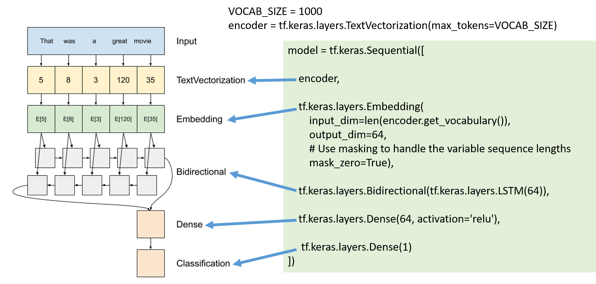

# Text Classification
- [Text Classification: 743 papers with code • 109 benchmarks • 102 datasets](https://paperswithcode.com/task/text-classification)
- [Text Classification on IMDb@State Of the Art](https://paperswithcode.com/sota/text-classification-on-imdb)

# 範例資料集IMDB dataset
- 網路電影資料庫（Internet Movie Database）的 IMDB 資料集（IMDB dataset）
- 包含 50,000 條影評文本。
- 從該資料集切割出的25,000條評論用作訓練，另外 25,000 條用作測試。
- 訓練集與測試集是平衡的（balanced），意味著它們包含相等數量的積極和消極評論。
- IMDB dataset that contains the text of 50,000 movie reviews from the Internet Movie Database. 
- These are split into 25,000 reviews for training and 25,000 reviews for testing. 
- The training and testing sets are balanced, meaning they contain an equal number of positive and negative reviews.
- 📽️🎬 [Sentiment Analysis of IMDB Movie Reviews | Kaggle(503)](https://www.kaggle.com/datasets/lakshmi25npathi/imdb-dataset-of-50k-movie-reviews)
  - [IMDB review Word2Vec & BiLSTM - 99% acc](https://www.kaggle.com/code/alexcherniuk/imdb-review-word2vec-bilstm-99-acc) 
  - [IMDB Review - Deep Model ~ 94.89% Accuracy](https://www.kaggle.com/code/nilanml/imdb-review-deep-model-94-89-accuracy/notebook)
  - [IMDB Movie Reviews word2vec,tfidf,bow](https://www.kaggle.com/code/jagarapusiva/imdb-movie-reviews-word2vec-tfidf-bow)

# 範例程式  電影評論文本分類
- [Basic text classification](https://www.tensorflow.org/tutorials/keras/text_classification)
  - text classification starting from plain text files stored on disk. 
  - will train a binary classifier to perform sentiment analysis on an `IMDB dataset`. 
  - tf.keras.utils.text_dataset_from_directory 
- [Text classification with TensorFlow Hub: Movie reviews](https://www.tensorflow.org/tutorials/keras/text_classification_with_hub)
  - use a pre-trained text embedding model from TensorFlow Hub called google/nnlm-en-dim50/2 
```
embedding = "https://tfhub.dev/google/nnlm-en-dim50/2"
hub_layer = hub.KerasLayer(embedding, input_shape=[], 
                           dtype=tf.string, trainable=True)
hub_layer(train_examples_batch[:3])
```
- [Text classification with an RNN](https://www.tensorflow.org/text/tutorials/text_classification_rnn)
  - 經典的Bi_LSTM model 
  - 
- [Classify text with BERT](https://www.tensorflow.org/text/tutorials/classify_text_with_bert) 
  - 使用Tensorflow-text
  - pre-train model 
```
def build_classifier_model():
  text_input = tf.keras.layers.Input(shape=(), dtype=tf.string, name='text')
  preprocessing_layer = hub.KerasLayer(tfhub_handle_preprocess, name='preprocessing')
  encoder_inputs = preprocessing_layer(text_input)
  encoder = hub.KerasLayer(tfhub_handle_encoder, trainable=True, name='BERT_encoder')
  outputs = encoder(encoder_inputs)
  net = outputs['pooled_output']
  net = tf.keras.layers.Dropout(0.1)(net)
  net = tf.keras.layers.Dense(1, activation=None, name='classifier')(net)
  return tf.keras.Model(text_input, net)
```
- REVIEW[Pre-trained Models for Natural Language Processing: A Survey(2020)](https://arxiv.org/abs/2003.08271)
# 範例學習:教科書[Keras 大神歸位](https://www.tenlong.com.tw/products/9789863127017?list_name=srh)
```
教科書[Keras 大神歸位]
深度學習全面進化！用 Python 實作CNN、RNN、GRU、LSTM、GAN、VAE、Transformer
François Chollet 著 黃逸華、林采薇 譯 黃逸華 審、施威銘研究室 監修
```
- 範例程式: [到官方網址下載](https://www.manning.com/books/deep-learning-with-python-second-edition?a_aid=keras&a_bid=76564dff) [GITHUB](https://github.com/fchollet/deep-learning-with-python-notebooks) 
- PART 4: Tensorflow RNN
  - 第10章：時間序列的深度學習  [範例程式](https://github.com/fchollet/deep-learning-with-python-notebooks/blob/master/chapter10_dl-for-timeseries.ipynb)
  - 👍🏻第11章：文字資料的深度學習
    - 11-1 概述自然語言處理(natural language processing, NLP)
    - 11-2 準備文字資料
    - 11-3 表示單字組的兩種方法：集合(set)及序列(sequence)
    - 11-4 [Transformer架構](https://github.com/fchollet/deep-learning-with-python-notebooks/blob/master/chapter11_part03_transformer.ipynb)
    - 11-5 [文字分類之外的任務-以Seq2seq模型為例](https://github.com/fchollet/deep-learning-with-python-notebooks/blob/master/chapter11_part04_sequence-to-sequence-learning.ipynb)


