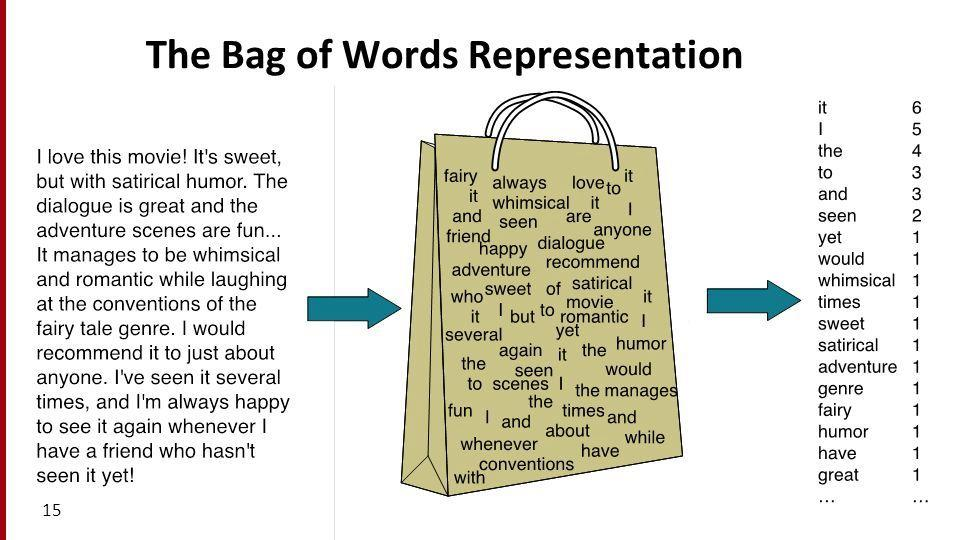
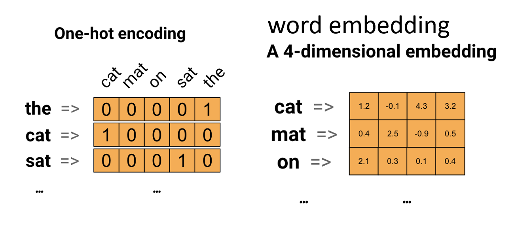
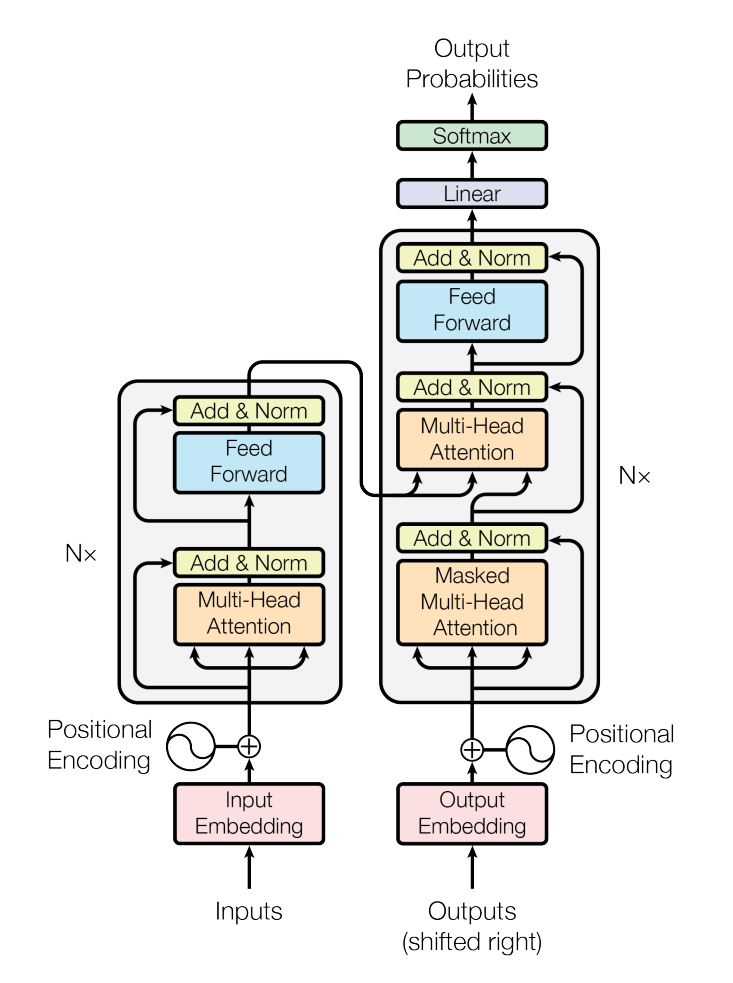
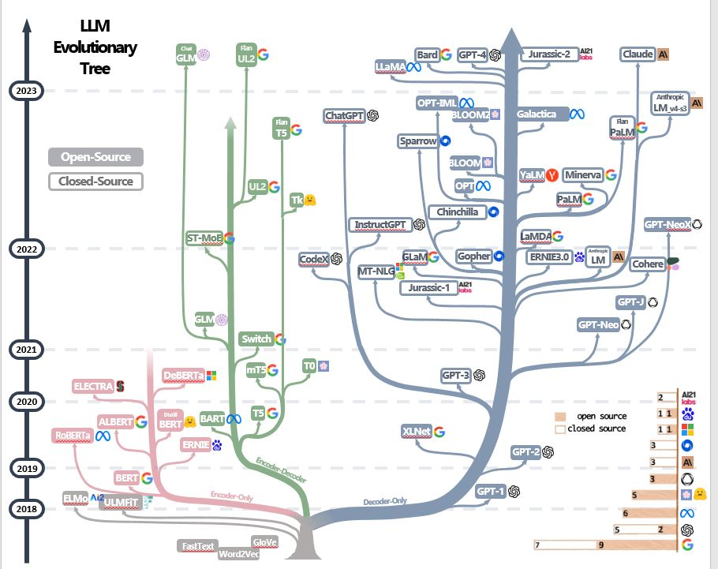

# Agenda
- NLP(Natural language processing) 自然語言處理 
- RNN Model and text classification
- Language Model
- Pretrained Model == > Large Language Models (LLMs)

# NLP(Natural language processing) 自然語言處理 
- NLP(Natural language processing) 自然語言處理 [AWS的介紹](https://aws.amazon.com/tw/what-is/nlp/)
  - 自然語言處理 (NLP) 是一種機器學習技術，讓電腦能夠解譯、操縱及理解人類語言。
  - 各企業組織擁有來自各種通訊管道的大量語音和文字資料，例如電子郵件、簡訊、社交媒體新聞摘要、影片、音訊等。
  - 他們使用 NLP 軟體來自動處理此資料，分析訊息中的意圖或情緒，並即時回應人類通訊。
- 文字向量化 vector representations of words
  - 將文字轉換為向量(文字向量化) 是一種自然語言處理(NLP) 程序。
  - 此程序會使用語言模型將文字對應至向量空間。 向量空間會以實數向量表示每個文字 
  - 各種作法
    - Label encoding | One Hot encoding [介紹文章](https://medium.com/@PatHuang/%E5%88%9D%E5%AD%B8python%E6%89%8B%E8%A8%98-3-%E8%B3%87%E6%96%99%E5%89%8D%E8%99%95%E7%90%86-label-encoding-one-hot-encoding-85c983d63f87)
      - sklearn.preprocessing.OneHotEncoder
    - 詞袋模型（Bag-of-Words Model, BoW）
      - 詞袋模型是一個基於單詞出現頻率來表示文字的方法，它並不考慮單詞的排列順序、或甚至是文法結構。
      - The sklearn.feature_extraction.text submodule gathers utilities to build feature vectors from text documents
      - CountVectorizer會計算單字出現在文件的次數
      - TF-IDF(Term Frequency - Inverted Document Frequency)
      - [簡單使用scikit-learn裡的TFIDF看看](https://ithelp.ithome.com.tw/articles/10228481)
    - 詞嵌入(Word embedding)
    - PreTrain model

圖片來源：[A Bag of Words: Levels of Language](https://sep.com/blog/a-bag-of-words-levels-of-language/)

## RNN Model
- RNN Model:  RNN | LSTM | GRU| bidirectional LSTM
- TENSORFLOW/KERAS:RNN
  - [tf.keras.layers.Embedding](https://www.tensorflow.org/api_docs/python/tf/keras/layers/Embedding)
  - [tf.keras.layers.TextVectorization ](https://www.tensorflow.org/api_docs/python/tf/keras/layers/TextVectorization)
  - 最常見的三大類型
    - [tf.keras.layers.SimpleRNN](https://www.tensorflow.org/api_docs/python/tf/keras/layers/SimpleRNN)
    - [tf.keras.layers.LSTM](https://www.tensorflow.org/api_docs/python/tf/keras/layers/LSTM)
    - [tf.keras.layers.GRU](https://www.tensorflow.org/api_docs/python/tf/keras/layers/GRU)
    - 雙向 [tf.keras.layers.Bidirectional](https://www.tensorflow.org/api_docs/python/tf/keras/layers/Bidirectional)
- Text classification(文章分類)
  - 資料集
    IMDB large movie review dataset
  - 各種分析技術
    - 【TensorFlow 官方教學課程】[Text classification with an RNN](https://www.tensorflow.org/text/tutorials/text_classification_rnn)
    - 【TensorFlow 官方教學課程】 [Classify text with BERT](https://www.tensorflow.org/text/tutorials/classify_text_with_bert)
- Time Series(時間序列分析)
  - [Modern Time Series Forecasting with Python(2022)](https://www.packtpub.com/product/modern-time-series-forecasting-with-python/9781803246802) [GITHUB](https://github.com/PacktPublishing/Modern-Time-Series-Forecasting-with-Python)

## Language Model
- 靜態詞向量預訓練模型
  - 神經網路語言模型
  - Word2vec 詞向量(GOOGLE)
    - 經典論文
    - Tomas Mikolov, Ilya Sutskever, Kai Chen, Greg S Corrado, and Jeff Dean.
      - Distributed representations of words and phrases and their compositionality.
      - In Advances in Neural Information Processing Systems (NIPS), pages 3111–3119, 2013
    - [Show, Attend and Tell: Neural Image Caption Generation with Visual Attention(201502)](https://arxiv.org/abs/1502.03044)
      - Kelvin Xu, Jimmy Ba, Ryan Kiros, Kyunghyun Cho, Aaron Courville, Ruslan Salakhutdinov, Richard Zemel, Yoshua Bengio
    - 【TensorFlow 官方教學課程】[Word embeddings](https://www.tensorflow.org/text/guide/word_embeddings)
  - GloVe 詞向量(史丹佛大學)  
    - 經典論文
      - Jeffrey Pennington, Richard Socher, and Christopher D Manning. 
      - Glove:Global vectors for word representation. 
      - In Conference on Empirical Methods on Natural Language Processing (EMNLP), pages 1532–1543, 2014
    - 官方網址[GloVe: Global Vectors for Word Representation](https://nlp.stanford.edu/projects/glove/) 
  - FastText (臉書)
    - Facebook AI Research Lab (FAIR) 所開發的『詞嵌入』以及『文本分類』，支援294 種語言，並且使用類神經網路訓練詞嵌入模型 
    - 經典論文[Enriching Word Vectors with Subword Information(2016)](https://arxiv.org/abs/1607.04606) 
    - [FastText modelgensim](https://radimrehurek.com/gensim/models/fasttext.html)
    - [fastText原理及实践](https://zhuanlan.zhihu.com/p/32965521)

- sequence-to-sequence (seq2seq) model
  - Seq2Seq（Sequence to sequence）模型，是將序列（Sequence）映射到序列的神經網絡機器學習模型。
  - 最初GOOGLE設計用於改進機器翻譯技術，可容許機器通過此模型發現及學習將一種語言的語句（詞語序列）映射到另一種語言的對應語句上。
  - Seq2Seq也能廣泛地應用到各種不同的技術上，如聊天機器人等，但需要有配對好的文本集才能訓練出對應的模型。
  - 經典論文[Sequence to Sequence Learning with Neural Networks(2014)](https://arxiv.org/abs/1409.3215)
  - 最重要的Encoder-Decoder架構
  - [教電腦寫作：AI球評——Seq2seq模型應用筆記(PyTorch + Python3)](https://gau820827.medium.com/%E6%95%99%E9%9B%BB%E8%85%A6%E5%AF%AB%E4%BD%9C-ai%E7%90%83%E8%A9%95-seq2seq%E6%A8%A1%E5%9E%8B%E6%87%89%E7%94%A8%E7%AD%86%E8%A8%98-pytorch-python3-31e853573dd0) 

## Pretrained Model == > Large Language Models (LLMs)

- Transformer 2017
  - 經典論文[Attention Is All You Need](https://arxiv.org/abs/1706.03762)
  - BOOKS [Transformers for Natural Language Processing - Second Edition(2022)](https://www.packtpub.com/product/transformers-for-natural-language-processing-second-edition/9781803247335) [GITHUB](https://github.com/Denis2054/Transformers-for-NLP-2nd-Edition)
  - BOOKS [Mastering Transformers(2021)](https://www.packtpub.com/product/mastering-transformers/9781801077651) [GITHUB](https://github.com/PacktPublishing/Mastering-Transformers)
  - huggingface[Transformers|State-of-the-art Machine Learning for PyTorch, TensorFlow, and JAX](https://huggingface.co/docs/transformers/index)
- BERT(Bidirectional Encoder Representations from Transformers) 2018
  - [BERT: Pre-training of Deep Bidirectional Transformers for Language Understanding Jacob Devlin, Ming-Wei Chang, Kenton Lee, Kristina Toutanova](https://arxiv.org/abs/1810.04805)
  - 參考書籍
    - [Getting Started with Google BERT(2021)](https://www.packtpub.com/product/getting-started-with-google-bert/9781838821593)  [GITHUB](https://github.com/PacktPublishing/Getting-Started-with-Google-BERT)
    - [基於 BERT 模型的自然語言處理實戰|李金洪](https://www.tenlong.com.tw/products/9787121414084?list_name=sp)
  - BERT Variants: ALBERT, RoBERTa, ELECTRA, and SpanBERT ........

- REVIEW
  - [Large-scale Multi-Modal Pre-trained Models: A Comprehensive Survey(2023)](https://arxiv.org/abs/2302.10035) [GITHUB](https://github.com/wangxiao5791509/MultiModal_BigModels_Survey)
  - [On the Opportunities and Risks of Foundation Models(2021)](https://arxiv.org/abs/2108.07258)
  - [A Comprehensive Survey on Pretrained Foundation Models: A History from BERT to ChatGPT(2023)](https://arxiv.org/abs/2302.09419)
  - [Harnessing the Power of LLMs in Practice: A Survey on ChatGPT and Beyond(202304)](https://arxiv.org/abs/2304.13712) 
    - [有用的GITHUB網址](https://github.com/Mooler0410/LLMsPracticalGuide)  [有用的PPT](https://github.com/Mooler0410/LLMsPracticalGuide/blob/main/source/figure_gif.pptx)
- BOOKS [全中文自然語言處理：Pre-Trained Model 方法最新實戰|車萬翔、郭江、崔一鳴 著(2022)](https://www.tenlong.com.tw/products/9789860776942?list_name=srh)  
